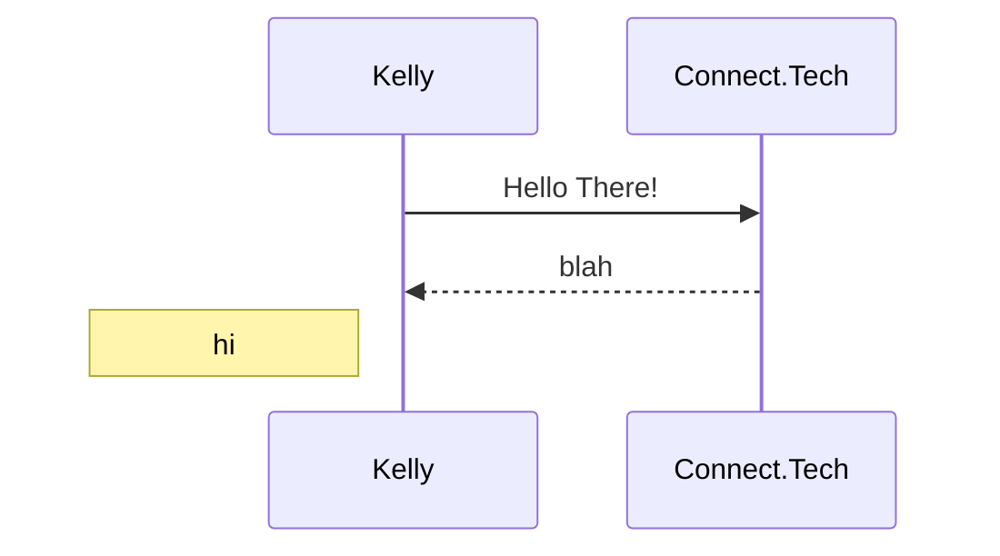
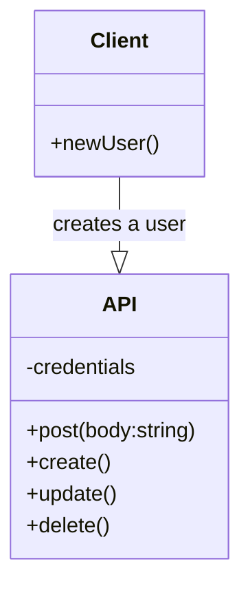

# Mermaid diagrams

Use CMD + K, then V to bring up the Markdown preview in Visual Studio Code.

## Sequence diagram

```mermaid
sequenceDiagram
    participant Kelly
    participant Connect.Tech
    Kelly->>Connect.Tech: Hello There!
    Connect.Tech-->>Kelly: blah
    note left of Kelly: hi
```

## Class diagram example

```mermaid
classDiagram
    Client --|> API: creates a user
    class Client {
        +newUser()
    }
    class API {
        -credentials
        +post(body:string)
        +create()
        +update()
        +delete()
    }
```
